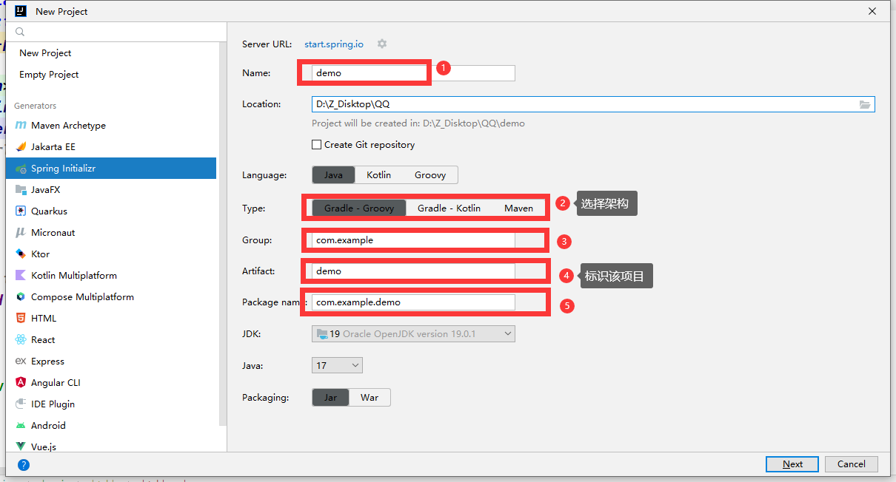

# 1. Spring Boot

> 关于创建项目遇到的一些基础问题：
>
> 

> ***整个项目的目录结构：***
>
> --src
>
> ​	-- main -----------------------------------**主要程序**
>
> ​		-- java 
>
> ​			-- com.example.demo -------***默认的项目包名***
>
> ​				-- controller-------------------***对外提供接口，比如说get方法和post方法请求***
>
> ​				-- entity-------------------------***一般里面的类就是用来和数据库中的表进行一一对应的***
>
> ​				--mapper ----------------------***默认的数据库接口实现类***
>
> ​				demoApplication.java ----***Spring Boot的启动类***
>
> ​		-- resources
>
> ​			-- static -----------------------------***存放一些静态网页什么的***
>
> ​			-- templates
>
> ​			application.properties --------***Spring Boot 的配置文件，我们可以在这里进行数据库的连接配置等等***
>
> ​	-- test --------------------------------------**单元测试程序**
>
> -- target --------------------------------------***生成的.class文件***
>
> pom.xml -------------------------------------***Maven框架的配置文件，我们在这里书写项目的相关依赖项***

***Spring Boot 的启动类：***

```Java
@SpringBootApplication
// 下面是指定mapper的扫描目录，扫描我们所写的所有的接口文件
@MapperScan("com.example.Springboot.mapper")
public class SpringbootApplication {

	public static void main(String[] args) {
		SpringApplication.run(SpringbootApplication.class, args);
	}

}
```

# 2. Mybatis

## @PutMapping("/{id}")

`@PutMapping` 是一个 Spring 框架中的注解，用于处理 HTTP PUT 请求方法。PUT 请求方法用于更新资源，即将请求的数据更新到服务器上的资源中。

使用 `@PutMapping` 注解可以将一个方法映射到指定的 URL 上，并且指定该方法处理 HTTP PUT 请求。例如：

```java
@RestController
@RequestMapping("/users")
public class UserController {
 
    @PutMapping("/{id}")
    public ResponseEntity<?> updateUser(@PathVariable("id") Long id, @RequestBody User user) {
        // 处理更新用户信息的逻辑
        return ResponseEntity.ok().build();
    }
}
```

上面的例子中，`@PutMapping` 注解标记的方法 `updateUser()` 映射到 `/users/{id}` URL 上，并且用于处理 HTTP PUT 请求。`@PathVariable` 注解表示 URL 中的 `{id}` 变量会被传递到方法的参数 `id` 中，`@RequestBody` 注解表示请求的数据会被映射到 `User` 对象中。

当客户端发送一个 PUT 请求到 `/users/1` URL 时，`updateUser()` 方法会被调用，并且将请求中的数据更新到 ID 为 1 的用户资源中。方法返回 `ResponseEntity.ok().build()` 表示更新成功，HTTP 响应码为 200。 

## @DeleteMapping("/{id}")

`@DeleteMapping` 是 Spring MVC 框架中的一个注解，用于处理 HTTP DELETE 请求方法。它可以将一个方法映射到指定的 URL 上，并且指定该方法处理 HTTP DELETE 请求。

在 Spring MVC 中使用 `@DeleteMapping` 注解的方法通常用于删除资源。客户端发送 DELETE 请求时，服务器会根据请求的 URL 或者其他参数来定位要删除的资源，并且执行删除操作。如果删除成功，服务器通常会返回一个 HTTP 204 No Content 响应码，表示删除成功但是不需要返回任何内容。

下面是一个使用 `@DeleteMapping` 注解的例子：

```java
@RestController
@RequestMapping("/users")
public class UserController {
 
    @DeleteMapping("/{id}")
    public ResponseEntity<?> deleteUser(@PathVariable("id") Long id) {
        // 处理删除用户的逻辑
        return ResponseEntity.noContent().build();
    }
}
```

上面的例子中，`@DeleteMapping` 注解标记的方法 `deleteUser()` 映射到 `/users/{id}` URL 上，并且用于处理 HTTP DELETE 请求。`@PathVariable` 注解表示 URL 中的 `{id}` 变量会被传递到方法的参数 `id` 中。

当客户端发送一个 DELETE 请求到 `/users/1` URL 时，`deleteUser()` 方法会被调用，并且将 ID 为 1 的用户资源从服务器中删除。方法返回 `ResponseEntity.noContent().build()` 表示删除成功，HTTP 响应码为 204。

