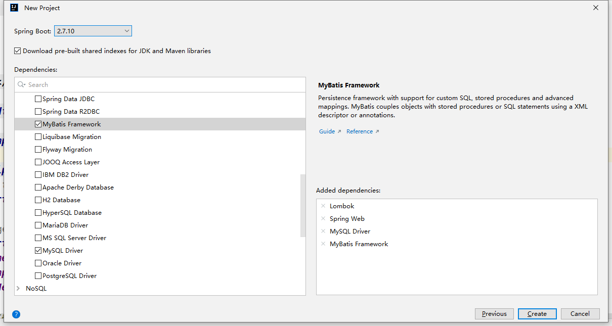
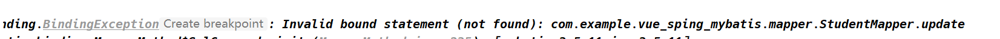
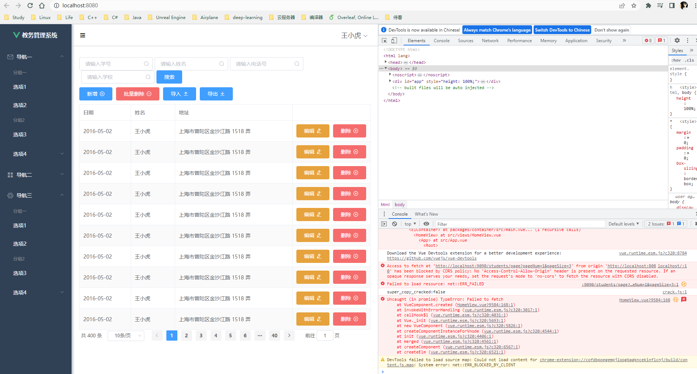
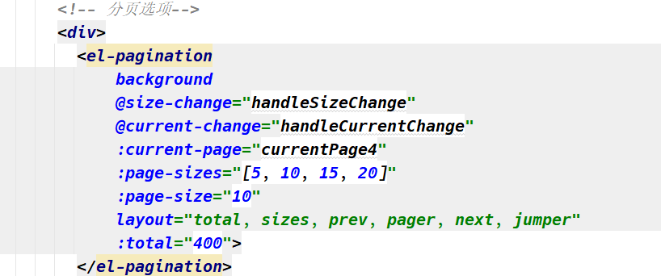

# Vue + Spring + Mybatis

> 记录第一次将前后端结合！

# 1. 创建Spring 项目



***1. 1修改后端或者端口：***

```properties
# 我们后端如果使用和前端一样的接口的话，就会导致前后端冲突
server.port=9090

spring.datasource.url=jdbc:mysql://localhost:3306/school?serverTimezone=GMT%2B8&characterEncoding=utf-8&useSSL=false
spring.datasource.username=root
spring.datasource.password=123456
spring.datasource.driver-class-name=com.mysql.cj.jdbc.Driver
```

***1.2 将前端拖进后端项目当中：***

这样方便我们对前后端项目进行编写!

***1.3 修改springboot配置文件为application.properties为application.yml***

这样编写配置的时候，就不会出现大量重复的代码。

```yml
# 我们后端如果使用和前端一样的接口的话，就会导致前后端冲突
server:
  port: 9090

spring:
  datasource:
    driver-class-name: com.mysql.jdbc.Driver
    url: jdbc:mysql://localhost:3306/school?serverTimezone=GMT%2B8&characterEncoding=utf-8&useSSL=false
    username: root
    password: 123456
```

# 2 .添加service 包

该包的目的就是为了封装，封装好之后直接由对应的`studentController`进行调用即可。

```java
@RestController
@RequestMapping("/students")
public class StudentController {
  @Autowired
  private StudentMapper studentMapper;
  
  @Autowired
  private StudentService studentServce;
}
```

比如说实例中，我们将插入和更新封装为一个操作为save函数，该功能就是与前端页面上的保存实现的是一样的功能！

# 3. MyBatis的动态SQL

MyBatis 的动态 SQL 实现主要是通过使用 XML 或者注解来实现的。

在 XML 中，我们可以使用 `<if>`、`<choose>`、`<when>`、`<otherwise>` 等标签来动态生成 SQL 语句。例如，我们可以根据传入的参数判断是否需要加入某个条件，比如：

```xml
<select id="getUserList" parameterType="java.util.Map" resultType="User">
  SELECT * FROM user
  <where>
    <if test="name != null">
      AND name = #{name}
    </if>
    <if test="age != null">
      AND age = #{age}
    </if>
  </where>
</select>
```

在上面的例子中，如果传入的参数 Map 中包含了 name 或者 age，则会在 SQL 语句中加入对应的条件。

在注解中，我们可以使用 `@SelectProvider`、`@UpdateProvider` 等注解来指定 SQL 语句的生成类。这个类需要实现 `org.apache.ibatis.builder.annotation.ProviderMethodResolver` 接口，并且需要有一个返回 SQL 语句的方法，方法名可以任意指定。例如：

```xml
@Mapper
public interface UserMapper {
  @SelectProvider(type = UserSqlProvider.class, method = "getUserList")
  List<User> getUserList(String name, Integer age);
}

public class UserSqlProvider {
  public String getUserList(String name, Integer age) {
    SQL sql = new SQL().SELECT("*").FROM("user");
    if (name != null) {
      sql.WHERE("name = #{name}");
    }
    if (age != null) {
      sql.WHERE("age = #{age}");
    }
    return sql.toString();
  }
}
```

在上面的例子中，如果传入的参数 name 或者 age 不为 null，则会在 SQL 语句中加入对应的条件。

总的来说，MyBatis 的动态 SQL 实现主要是通过在 SQL 语句中加入条件判断来实现的，这些条件判断可以通过 XML 或者注解的方式来生成。这种方式可以让 SQL 语句更加灵活、可读性更高，并且能够根据不同的参数动态生成不同的 SQL 语句，从而提高应用的性能和可维护性。

# 4. 记录报错



> 原因是为什么呢？
>
> 因为SpringBoot框架并不认识我们的Mybatis XML配置文件，也不知道为什么要写这个XML文件.
>
> 所以说我们需要在Spring Boot配置文件中添加相关的配置文件。

# 5. 奇葩报错总结

<h2>1. xml 配置文件第一行不能写注释</h2>

XML 配置文件的第一行通常是 XML 声明，用于指定 XML 版本和编码，格式如下：

```
xmlCopy code
<?xml version="1.0" encoding="UTF-8"?>
```

在这行中可以包含注释，但是注释必须出现在 XML 声明之前，且必须使用 XML 注释语法 `<!-- 注释内容 -->` 包裹起来，例如：

```
xmlCopy code<!-- 这是一个 XML 配置文件 -->
<?xml version="1.0" encoding="UTF-8"?>
```

这样的写法是合法的，并且常用于说明文件的用途、作者、版本等信息。注意，XML 声明和注释之间不能有任何内容或空行，否则会导致解析错误。

<h2>2. 前端跨域问题</h2>



前端是8080，后端是9090，所以肯定会出现跨域问题。

> 跨域问题（Cross-Origin Resource Sharing，CORS）是由于浏览器的同源策略导致的，同源策略是浏览器最核心的安全功能之一，是一种基于域名、协议和端口号的安全策略，限制了从一个源加载的文档或脚本如何与另一个源的资源进行交互。
>
> 简单来说，当一个页面的脚本试图去访问不同域名下的资源时，浏览器会阻止这种跨域行为，例如通过 Ajax 请求获取另一个域名下的数据。
>
> 解决跨域问题的方式有很多，最常用的方式是使用 CORS 机制，即服务器端设置响应头 Access-Control-Allow-Origin，允许指定的域名访问资源。还有其他的解决方式，例如 JSONP、代理服务器等，但是 CORS 是最为常用和推荐的方式。

解决办法：

***办法一：***

可以使用 `@CrossOrigin` 注解来实现跨域请求。在 Controller 类或方法上添加该注解即可，示例如下：

```java
@RestController
@CrossOrigin(origins = "*", maxAge = 3600)
public class UserController {

    @GetMapping("/users")
    public List<User> getAllUsers() {
        // ...
    }

    // ...
}
```

***方法二：***

> 参考博客：http://mtw.so/6ukilI

在Springboot项目里加上这个配置文件`CorsConfig.java`，重启之后即可实现跨域访问，前端无需再配置跨域。

```java
import org.springframework.context.annotation.Bean;
import org.springframework.context.annotation.Configuration;
import org.springframework.web.cors.CorsConfiguration;
import org.springframework.web.cors.UrlBasedCorsConfigurationSource;
import org.springframework.web.filter.CorsFilter;

@Configuration
public class CorsConfig {

    // 当前跨域请求最大有效时长。这里默认1天
    private static final long MAX_AGE = 24 * 60 * 60;

    @Bean
    public CorsFilter corsFilter() {
        UrlBasedCorsConfigurationSource source = new UrlBasedCorsConfigurationSource();
        CorsConfiguration corsConfiguration = new CorsConfiguration();
        corsConfiguration.addAllowedOrigin("*"); // 1 设置访问源地址
        corsConfiguration.addAllowedHeader("*"); // 2 设置访问源请求头
        corsConfiguration.addAllowedMethod("*"); // 3 设置访问源请求方法
        corsConfiguration.setMaxAge(MAX_AGE);
        source.registerCorsConfiguration("/**", corsConfiguration); // 4 对接口配置跨域设置
        return new CorsFilter(source);
    }
}
```

# 6. 分页查询的实现

> 这里设计查询结果页需要返回什么数据的时候，我们需要和我们的前端结合起来，看我们的前端需要什么数据，我们就设计相应的类去实现。
>
> 

我们要考虑分页的相关数据，就是上图所示中的：`total`、`page-sizes`、`page-size`都需要我们去手动绑定变量。