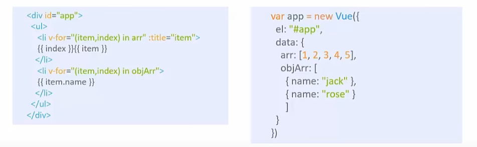

# Vue.js

> Vue2.0 官网：https://v2.cn.vuejs.org/v2/guide/#Vue-js-%E6%98%AF%E4%BB%80%E4%B9%88

> DOM的系统：
>
> 文档对象模型(DOM) 是**HTML 和XML 文档的编程接口**。 它提供了对文档的结构化的表述，并定义了一种方式可以使从程序中对该结构进行访问，从而改变文档的结构，样式和内容。 DOM 将文档解析为一个由节点和对象（包含属性和方法的对象）组成的结构集合。 简言之，它会将web 页面和脚本或程序语言连接起来。
>
> **就是我们将网页和我们的逻辑联系起来，实现通过我们的程序语言或者脚本来动态的改变相应的网页内容。**

# 1. 第一个Vue程序

```html
<!DOCTYPE html>
<html lang="en">
<head>
    <meta charset="UTF-8">
    <meta http-equiv="X-UA-Compatible" content="IE=edge">
    <meta name="viewport" content="width=device-width, initial-scale=1.0">
    <title>Hello,Vue</title>
</head>
<body>
    
    
    <div id="app">
        {{ message }}
    </div>
    
</body>
<!-- 开发环境版本，包含了有帮助的命令行警告 -->
<!-- 该版本开发环境和另一个开发环境比起来就是一个是简洁版一个是复杂版-->
<script src="https://cdn.jsdelivr.net/npm/vue@2/dist/vue.js"></script>
<script>
    var app = new Vue({
    el: '#app',
    data: {
        message: 'Hello Vue!'
    }
})
</script>
</html>
```

## 1.1 el挂载点

通过CSS选择器来设置Vue实例管理的元素：

```js
<script>
    var app = new Vue({
    el: '#app',
    <!-- 我们在实际应用中一般都是使用id选择器，行业中默认的规范-->
    data: {
        message: 'Hello Vue!'
    }
})
</script>
```

## 1.2 data数据对象

数组、对象数据的创建以及绑定：

```html
<body>
    <div id="app">
        <div>{{ message }}</div>
        <div>{{ Array }}</div>
        <div>{{ Object }}</div>
    </div>
    
</body>
<!-- 开发环境版本，包含了有帮助的命令行警告 -->
<script src="https://cdn.jsdelivr.net/npm/vue@2/dist/vue.js"></script>
<script>
    var app = new Vue({
    el: '#app',
    data: {
        message: 'Hello Vue!',
        Array:["北京","上海","天津","重庆"],
        Object:{
            name:"周鹏飞",
            old:"20",
            phonenumber:"17698266260"
        }
    }
})
```

**注意我们不再和 HTML 直接交互了。一个 `Vue` 应用会将其挂载到一个 DOM 元素上 (对于这个例子是 `#app`) 然后对其进行完全控制。那个 HTML 是我们的入口，但其余都会发生在新创建的 `Vue` 实例内部。**

# 2. 本地应用介绍

## 2.1 内容绑定，事件绑定

> v-text、v-html、v-on

<h3>v-text</h3>

该指令的目的是为了设置标签的文本值：

无论标签内部有什么内容，其全部都会被我们所绑定的参数的值所替换掉，如果说不想要这种效果的话，我们可以选择使用最原始的方法**使用两个大括号来进行值的传递，该种方法称之为插值表达式！**

```html
<!-- 该指令使用方法如下面所示，将对应变量和其绑定一起即可-->
<h2 v-text = "message"></h2>
```

<h3>v-html</h3>

该指令的作用和上面一个指令的作用是一样的，都是设置内容的值，只不过`v-html`指令设置的内容有些特殊，设置的是`html`内容。设置标签的`innerHTML`。

```html
<p v-html="content"></p>
······
<script>
    var app = new Vue({
    el: '#app',
    data: {
        content: "<a href='https://www.baidu.com'>Hello,World!</a>"
    }
})
······
```


<h3>v-on</h3>

该指令的作用就是给元素绑定事件，比如说鼠标点击事件、鼠标移动事件


**我们也可以将前面的v-on:替换为@符号，这样就可以大量的减少冗余的代码。**


```html
<input type="submit" value="v-on指令" @click="doIT">


<script>
    var app = new Vue({
    el: '#app',
    methods: {
        doIT:function(){
            alert("Hello,World!")
        }
    }
})
</script>
```

在vue当中，我们不需要考虑如何去更改DOM元素，我们重点放在更改我们的数据即可。怎么修改呢，通过方法的调用即可。

## 2.2 显示切换，属性绑定

> v-show、v-if、v-bind

<h3>v-show</h3>

根据表达式的真假切换元素的显示和隐藏。


<h3>v-if</h3>

根据表达式的真假，切换元素的显示和隐藏(操纵`dom`元素,直接操作元素)


<h3>v-bind</h3>

设置元素的属性（`src`、`title`、`class`）


上面的`v-bind`是可以省略的：


## 2.3 列表循环，表单元素绑定

> v-for、v-on补充、v-model

<h3>v-for</h3>

根据数据生成列表结构。



<h3>v-on补充</h3>

传递自定义参数以及事件修饰符的使用。


<h3>v-model</h3>

`Vue` 还提供了 `v-model` 指令，它能轻松实现表单输入和应用状态之间的双向绑定。

```html
<div id="app-6">  
	<p>{{ message }}</p>  
	<input v-model="message">
</div>
```

```js
var app6 = new Vue({
  el: '#app-6',
  data: {
    message: 'Hello Vue!'
  }
})
```

> https://www.bilibili.com/video/BV1YE411A746?p=4&spm_id_from=pageDriver&vd_source=fab299451215981d1b6ba4532cbf0861
>
> ###### ***CDN是什么？***
>
> 这是一种加速策略，能够从离自己最近的服务器上快速的获得外部的资源。
>
> 我们如果注意的话就会发现导入的那个script脚本就是使用的CDN：
>
> ```html
> <script src="https://cdn.jsdelivr.net/npm/vue@2/dist/vue.js"></script>
> ```

# MVVM

> ***M: Model    V: View      VM: `ViewModel`(连接视图和数据的中间件)***.


> `Vue`中包含什么呢？
>
> 包含了**DOM Listeners**和**Data Bindings**:
>
> ***DOM Listeners做的是什么事情呢？监听器，监听数据的变化，数据一旦发生变化，就会使得下面的Data Bindings 绑定的数据发生变化，就会使得视图中对应的数据发生变化。***
>
> 在MVVM架构中，是不允许数据和视图直接进行通信的，只能通过`ViewModel`来进行通信，而ViewModel就是定义了一个`Observer`观察者：
>
> - `ViewModel` 可以观察到数据的变化，并且对视图对应的内容进行更新；
> - `ViewModel` 能够监听到视图的变化，并且能够通知数据发生改变；
>
> 至此，我们就可以明白，Vue.js就是一个MVVM的实现者，他的核心就是实现了***DOM 监听***和***数据绑定***。


> 在上面的图中，View就是我们的Watcher.

***`Vue` 的很重要的特性就是组件化，就是将一个页面中的内容组件化，将其分裂成若干个组件，然后进行复用以及组合，页面不过仅仅是组件的容器，这样可以大大的提高我们的开发效率。***

## 1. 插值表达式

> 插值表达式是用在HTML中被绑定的元素当中的，目的是通过插值表达式来获取`Vue`对象中的属性和方法。
>
> 注意插值表达式不能写在HTML的标签当中，不能作为属性的值的部分。

那么`Vue`对象的属性是哪里进行提供的呢？

```vue
new Vue({
	data:{}   // <== 该data提供属性
})
```

`Vue`对象的方法是哪里进行提供的呢？

```vue
// 4. 注意methods方法这里使用的也是大括号，同样是json属性，所以说里存放的也是一些键值对，即我们的方法其实就是键值对
// 键就是我们定义的方法名，后面的值是具体的方法function
methods: {
	methodName: function() {
		alert("Hello,Vue!");
  },
},
```

##  2. MVVM 双向数据绑定：v-model

```html
<div id="app">
  <input type="text" v-model="title"/>
</div>
```

## 3. 事件绑定：v-on

```html
<input type="text" v-on:input="changeTitle"/>
```

v-on叫做绑定事件，事件是input，响应行为是`changeTitle`. 也就是说当input元素发生输入事件的时候，就会调用`vue`当中定义的`changeTitle`方法。

如果我们想要改变` vue`当中的属性的话，需要使用`this`来进行调用，因为VUE是一个对象，我们如果想要调用其属性肯定需要使用到`this`关键字。

还需要注意一点的是，我们定义的`methods`中的函数的参数列表可以使用`event`即获得当前的事件，然后通过`event.target.value`来获取相应对象的值。

> 1. 我们可以在相应函数当中，可以指明使用`event`内置的参数对象，该对象表示的是当前事件，可以通过`event.target.value`来获得当前事件对象的value值002。
> 2. v-on可以简写：
>
> `v-on:input =""    ==> @input=""`

## 4. v-bind

> 我们知道插值表达式是不能写在HTML的标签的属性当中的，如果一定要使用vue中的属性作为HTML的属性内容的话，就可以通过v-bind进行属性绑定。 

```html
<a v-bind:href="link"></a>
<!-- 这里可以进行简写-->
<a :href="link"></a>

<script>
	var app = new Vue({
    data:{
      link : 'https://www.baidu.com'
    }
  })
</script>
```

## 5. v-once指令

指明此元素的数据只出现一次，数据内容的修改不影响此元素。

即声明一个常量。

```html
<p v-once>{{title}}</p>
```

#  事件

> 1. 参数传递；
> 2. 停止鼠标事件；
> 3. 事件修饰符；

# Vue组件化

也就是可以将`Vue`对象作为一个组件，被反复的使用.我们要想实现组件化，需要在页面中注册组件，关于注册的方式具有两种，分别是全局注册和本地注册。

## 1. 全局组件

通过`Vue.component`全局方法定义，可以在任何`Vue`实例当中进行使用。

```js
Vue.component('my-component',{
  // component options
})
```

## 2.局部组件

在`Vue`实例当中的`components`选项当中定义，只能在当前实例以及其子组件中进行使用

```js
new Vue({
  el: '#app',
  components: {
    'my-component': {
      // component options
    }
  }
})
```

## 3. 单文件组件

通过`.vue`文件定义，包含了模板、样式和脚本，可以使用`Webpack`等构建工具将其打包为JavaScript文件

```vue
<template>
  <div>
    <!-- component template -->
  </div>
</template>

<script>
export default {
  // component options
}
</script>

<style>
/* component styles */
</style>
```

无论使用哪种方式定义组件，组件本质上是一个可重用的Vue实例，拥有自己的模板、脚本和数据。组件可以接受传入的参数（即组件的属性或props），并可以向父组件或全局作用域中发送事件。在Vue.js中，组件是构建大型应用程序的重要工具之一。


# 编写`App.vue`


## 1. 注意template必须有一个根节点


## 2. `Vue`项目中组件的全局注册

需要在`main.js`进行全局注册：

```js
import Header from './components/Header.vue'
import Content from './components/Content.vue'
// 所以说我们Vue项目的入口文件App.vue也需要在这里需要进行一个全局注册
import App from './App.vue'

// 导入之后需要进行全局注册
Vue.component('MyHeader':Header);
Vue.component('MyContent':Content);
```


## 3. `Vue`项目中组件的本地注册

就是直接在App.vue文件中进行注册：

```vue
<template>
  <div id="app">
    
    <HelloWorld msg="Welcome to Your Vue.js App"/>
  </div>
</template>

<script>
import HelloWorld from './components/HelloWorld.vue'
import Content from './components/Content.vue'
  
  
export default {
  name: 'App',
  components: {
    HelloWorld,
      "MyContent":Content
  }
}
```

## 4. 组件之间传递参数

```vue
// HelloWorld.vue 组件
<template>
·····
</template>

<script>
	export default {
    name: 'HelloWorld',
    props:{
      msg:String
    }
  }
</script>
```

```vue
// App.vue 组件
<template>
  <div id="app">
    
    <HelloWorld msg="Welcome to Your Vue.js App"/>
  </div>
</template>

<script>
import HelloWorld from './components/HelloWorld.vue'

export default {
  name: 'App',
  components: {
    HelloWorld
  }
}
</script>
```


# HTTP请求--Ajax

## 1. `Axios`介绍

```vue
<template>
  <div>
    <h1>Users</h1>
    <ul>
      <li v-for="user in users" :key="user.id">
        {{ user.name }}
      </li>
    </ul>
  </div>
</template>

<script>
import axios from 'axios';

export default {
  data() {
    return {
      users: []
    };
  },

  mounted() {
    axios.get('https://jsonplaceholder.typicode.com/users')
      .then(response => {
        this.users = response.data;
      })
      .catch(error => {
        console.error(error);
      });
  }
};
</script>
```

在上面的示例中，我们使用`Vue`组件的`mounted()`生命周期钩子来发送GET请求到https://jsonplaceholder.typicode.com/users API。如果请求成功，`Axios`将使用响应数据更新组件的`users`数据。如果请求失败，`Axios`将抛出一个错误并使用`.catch()`方法处理错误。

这只是一个简单的示例，您可以使用`Axios`发送各种类型的请求，例如POST、PUT和DELETE请求，并处理响应数据和错误。


# 跨域问题

> `Vue`项目部署在服务器：http://localhost:8080;
>
> 后端接口部署在服务器：http://localhost:8090;
>
> **当`Vue`去访问后端接口的时候就会出现跨域问题。**

> 跨域问题（Cross-Origin Resource Sharing，CORS）是指在 Web 应用程序中，当浏览器试图访问与当前页面不同源（协议、域名或端口号）的资源时，会出现的一种安全限制问题。例如，如果一个网页中的 JavaScript 代码试图从一个不同源的服务器上获取数据，浏览器就会发出跨域请求，这时服务器就会拒绝请求并返回一个错误信息，以保护用户的数据安全。
>
> 跨域问题是由浏览器的同源策略（Same-Origin Policy）引起的，同源策略是浏览器的一项安全特性，它限制了脚本只能访问与其来源相同的资源。因此，如果需要跨域访问资源，就需要在服务器端设置一些响应头，以告诉浏览器允许跨域访问。


# 路由问题（组件之间的跳转）

> 路由是由第三方模块提供的
>
> 在`Vue`中的路由，能够帮助我们在一个`Vue`组件中实现其他组件的互相切换。
>
> 也就是说可以**通过路由模块将指定的组件显示在路由视图**当中。
>
> ***如何实现路由跳转？***

## 1. 安装路由模块

```shell
npm install vue-router -s
```

## 2. 设计路由界面

即设计各种页面用来跳转。

## 3. 创建静态路由表

在`src`文件夹下创建文件`router.js`并编辑：

```js
import HomeVue from './views/HomeVue';
import ProductVue from './views/ProductVue';

// 创建路由表
// 1. 这里是一个数组，数组里面存储的是一个一个的对象
export const routes = [
    {
        path:'/Home',
        component:HomeVue
    },
    {
        path:'/Products',
        component: ProductVue
    }
]
```

## 4. 引入路由模块并使用

在`main.js`中使用路由模块以及注册路由表。

```js
import Vue from 'vue'
import App from './App.vue'
import Router from 'vue-router'  // 1. 引入路由模块
import {routes} from './router'  // 2. 引入静态路由表

Vue.use(Router); // 3. 使用路由模块

Vue.config.productionTip = false

// 4. 创建一个routes模块的实例
const router = new Router({
  routes:routes
})

new Vue({
  router, // 5. 将router实例放入vue实例当中
  render: h => h(App),
}).$mount('#app')


// 这里结束之后我们记得在App.vue文件中使用router组件：
// <template>
//  <div id="app">
//    <router-view></router-view>
//  </div>
//</template>
```

## 5. 路由初体验

我们会发现当我们输入http://localhost:8080/#/products以及http://localhost:8080/#/home的时候，所看到的的页面不一样，***我们需要注意的是，我们所在的页面并没有发生改变，改变的只是页面所呈现的内容而已！！***


## 6. 链接路由的实现

```App.vue
<template>
  <div id="app">
    <div>
      <span>
        <router-link to="/Home">首页</router-link>
      </span>
      <br>
      <span>
        <router-link to="/Products">商品列表</router-link>
      </span>
    </div>

    <router-view></router-view>
  </div>
</template>
```

当点击首页的时候，程序会去路由表中寻找路由表项，然后将对应的各种组件渲染到下面的`<router-view></router-view>`当中。

## 7. 参数的传递

### 7.1 设置参数

通过路由表设置参数：

```js
import HomeVue from './views/HomeVue';
import ProductVue from './views/ProductVue';

// 创建路由表
// 1. 这里是一个数组，数组里面存储的是一个一个的对象
export const routes = [
    {
        path:'/Home',
        component:HomeVue
    },
    {
        path:'/Products/:id',
        component: ProductVue
    }
]
```


### 7.2 传递参数

```vue
<span>
  <router-link to="/Products/1">商品列表</router-link>
</span>
```

通过**router-link**的**to**参数来传递**id**。


### 7.3 接受参数

在相应的组件中，通过`Vue`中的`$router.params.id`来接受参数。


## 8. 程序式路由的实现


## 9. 路由之间跳转的方式

- 通过HTML中的`<router-link to = "路由地址"></router-link>`进行跳转；
- 通过`js`实现路由的跳转；

```js
<script>
export default {
  name: 'App',
  components: {

  },
  methods:{
    func1(){
      this.$route.push("/Home");
    }
  }
}
</script>
```


# 资源打包

当我们将我们所编写的项目进行部署的时候，我们首先需要对我们的项目进行打包：

```shell
npm run build
```

打包之后会出现一个`dist`的文件夹，我们只需要将该文件夹下面的所有的文件部署到我们的服务器上即可完成访问，该文件夹中会包含所有的的静态资源，比如说图片之类的内容。


所以说在开发环境下要想使用静态资源，首先通过`npm run build`命令来创建`dist`文件夹，然后将静态资源放入，接着在`vue`的代码文件中使用`dist`文件夹下面的资源即可。

# 创建`Webpack`项目

> https://kuangpf.com/vue-cli-analysis/init/
>
> 首先需要安装`vue init`:
>
> ```shell
> npm install -g @vue/cli-init
> ```
>
> 然后使用init参数创建模板：
>
> ```shell
> vue init webpack myvuedemo
> ```
>
> 

## 1. 安装依赖：

`vue-router`、`element-ui`、`sass-loader`、`node-sass`四个插件，后面两个插件是和CSS有关的。

```shell
安装路由模块：
npm install -S vue-router@3

安装element-ui模块：
npm i element-ui -S

安装sass-loader、node-sass(可装可不装):
npm install sass-loader node-sass --save-dev

安装axios:
npm install --save axios vue-axios
```

## 2. 路由配置，新的配置方案

- 首先在`src`文件夹下面创建`router`文件夹，里面新建文件`index.js`:


```js
import Vue from "vue";

import Router from "vue-router"; // 导入路由插件

import Login from "../views/Login.vue"; // 导入我们自定义的模块

Vue.use(Router);  // 安装路由

// 配置路由：
// routes 是一个键，后面对应的是数组，数组中存储的是我们的路由对象
export default new Router({
  routes:[
    {
      // 路由路径
      path:'/Login',
      // 路由名称
      name:'Login',
      // 跳转到组件
      component:Login
    }
  ]
})
```

- 接着在`main.js`文件中导入：

```js
···
import VueRouter from 'vue-router';
import router from "./router";
···
Vue.use(VueRouter);
···
/* eslint-disable no-new */
new Vue({
  el: '#app',
  router,
  components: { App },
  template: '<App/>'
})
```

- 最后一步就是在App.vue中创建路由视图；

```vue
<router-view></router-view>
```

# Mock假数据

假数据，提供假数据，可以让前端不需要等待后端的接口，而直接进行下一步的开发。

一个常用的工具是：`easy-mock`;

# 配置嵌套路由

> 嵌套路由又称为子路由，在实际应用中，通常是由多层嵌套的组件组合而成，同样的，URL中各段动态路径也是按照某种结构对应嵌套的各层组件，例如：
>
> 

```js
  {
    path: '/example',
    component: Layout,
    redirect: '/example/table',
    name: 'Example',
    meta: { title: 'Example', icon: 'el-icon-s-help' },
    children: [
      {
        path: 'table',
        name: 'Table',
        component: () => import('@/views/table/index'),
        meta: { title: 'Table', icon: 'table' }
      },
      {
        path: 'tree',
        name: 'Tree',
        component: () => import('@/views/tree/index'),
        meta: { title: 'Tree', icon: 'tree' }
      }
    ]
  },
```

## 路由重定向

## 路由传递参数

### 1. 使用路径匹配的方式

#### 1.1 修改路由配置

```js
{
  path:'user/profile/:id',
  name:'UserProfile',
  component:UserProfile
}
```

说明：主要是在`path`属性中添加了`:id`这样的占位符。

#### 1.2 传递参数

***（1）router-link***

```vue
<router-link :to="{name: 'UserProfile', params:{id:1}}">个人信息</router-link>
```

说明：此时我们将`to`改为了`:to`,是为了将这一属性当成对象使用，注意`router-link`中的`name`属性一定要和路由中的`name`属性名称保持一致，因为这样`Vue`才可以找到对应的路由路径。

***(2) 代码方式***

```vue
this.$router.push({ name: 'UserProfile', params: {id: 1}}); // 传递的id是参数名，后面是对应的值
```

### 2. 使用`props`的方式

#### 2.1 修改路由配置


#### 2.3 传递参数


#### 2.4 接收参数
