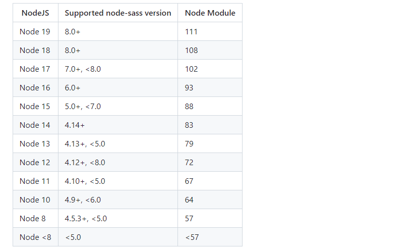
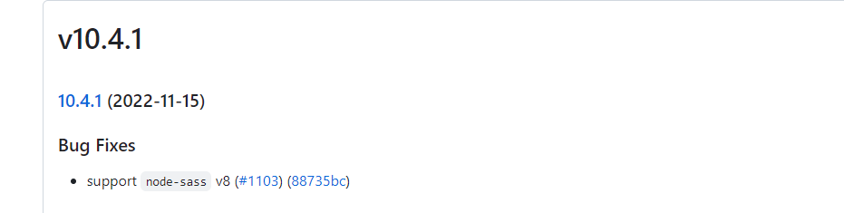

# 1. 安装路由的时候报错

> https://stackoverflow.com/questions/72444072/i-cant-install-vue-router-by-npm

```shell
npm install vue-router --save
```

输出结果为：

```output
PS D:\Desktop\vue_router> npm install vue-router --save
npm ERR! code ERESOLVE
npm ERR! ERESOLVE unable to resolve dependency tree
npm ERR!
npm ERR! While resolving: vue_router@0.1.0
npm ERR! Found: vue@2.7.14
npm ERR! node_modules/vue
npm ERR!   vue@"^2.6.14" from the root project
npm ERR!
npm ERR! Could not resolve dependency:
npm ERR! peer vue@"^3.2.0" from vue-router@4.1.6
npm ERR! node_modules/vue-router
npm ERR!
npm ERR! Fix the upstream dependency conflict, or retry
npm ERR! this command with --force, or --legacy-peer-deps
npm ERR! to accept an incorrect (and potentially broken) dependency resolution.
npm ERR!
npm ERR! See C:\Users\z1769\AppData\Local\npm-cache\eresolve-report.txt for a full report.

npm ERR! A complete log of this run can be found in:
npm ERR!     C:\Users\z1769\AppData\Local\npm-cache\_logs\2023-04-11T06_15_42_428Z-debug-0.log
```

该错误是因为安装的`Vue`和`vue-router`版本不一致：

- `vue@2`对应的版本为`vue-router@3`;
- `vue@3`对应的版本为`vue-router@4`;

> The error message indicates you have `vue@2.6.14`, and you're trying to install `vue-router@4.0.15`. Note that `npm install -S vue-router` (without a version specifier) defaults to the `latest` version, which is [currently `4.0.15`](https://www.npmjs.com/package/vue-router?activeTab=versions).
>
> Don't use the `--force` or `--legacy-peer-deps` npm flags that are suggested in the error message because that would only install incompatible packages that would result in a runtime error.

解决方法：

1. 安装`vue-router@3`:

```shell
npm install -S vue-router@3
```

2. 升级到vue3版本，我们需要先卸载`vue-template-compiler`，然后下载`@vue/compiler-sfc`:

```shell
npm uninstall -S vue-template-compiler
npm install -S vue@3 @vue/compiler-sfc
```

> Or you can upgrade to Vue 3, which requires uninstalling `vue-template-compiler` (the template compiler for Vue 2) and installing `@vue/compiler-sfc` (the template compiler for Vue 3):

# 2. 安装`node-sass`和`sass-loader`

> 我们需要先安装`node-sass`，然后再去安装`sass-loader`。

***2.1 安装`node-sass`***

先查看自己`node`的版本号，然后去官网去查看对应的版本号：

https://github.com/sass/node-sass

```shell
$ node -v
v18.5.0
```

我的版本是18.5.0，查看网站之后：



默认安装最新版即可满足：

```shell
$ npm install node-sass
```

如果要安装不同的版本，更换下面的数字即可：

```shell
$ npm install node-sass@6.0.1 -D
```

***2.2 安装`sass-loader`***

这里需要注意安装和node-sass版本匹配的版本，同样查看官网：

https://github.com/webpack-contrib/sass-loader



找到相应的版本下载即可：

```shell
$ npm install sass-loader@10.4.1 -D
```

