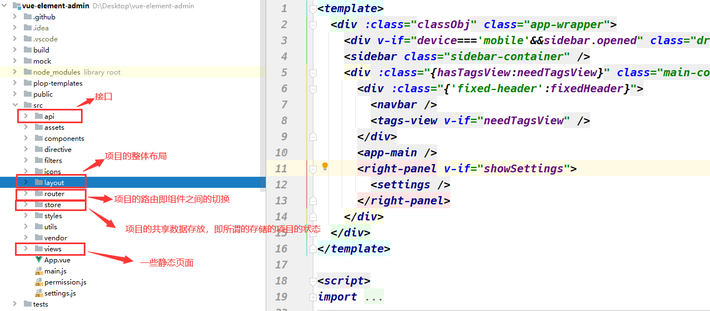
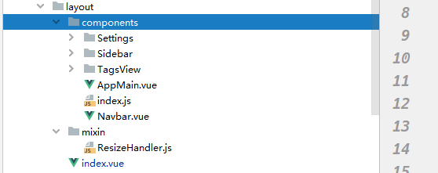
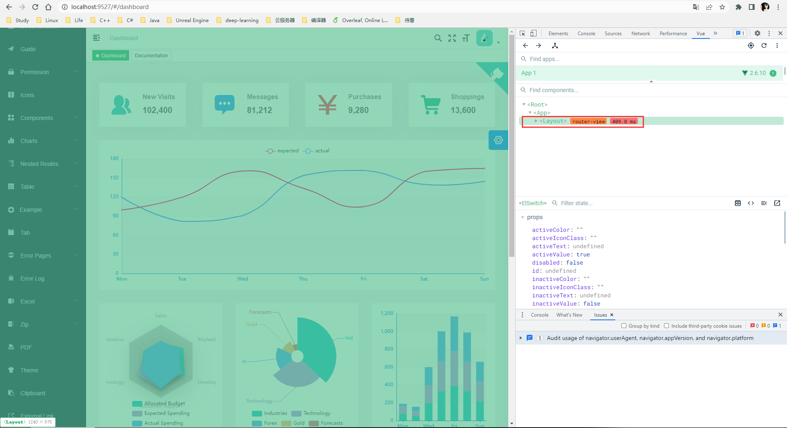
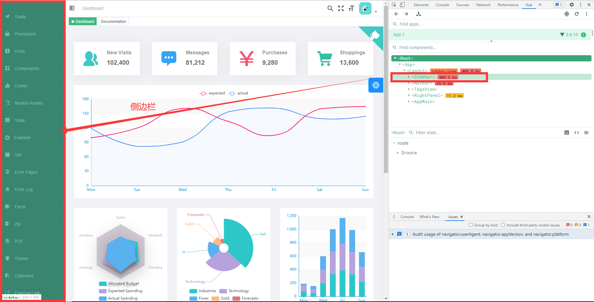
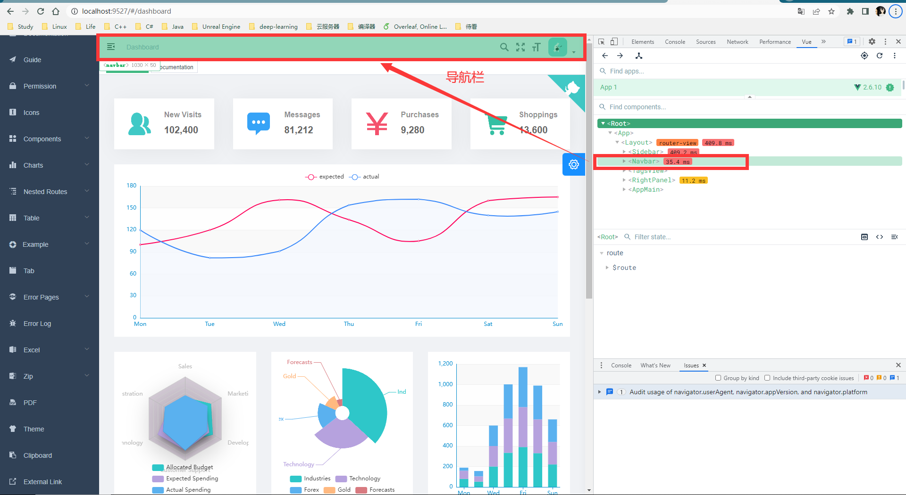
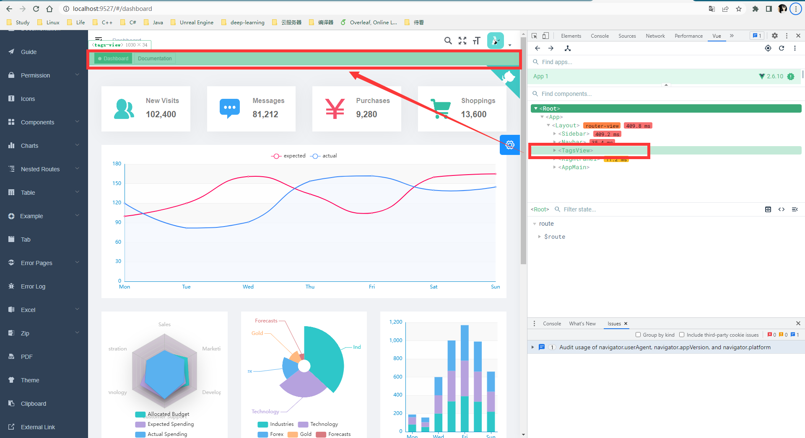
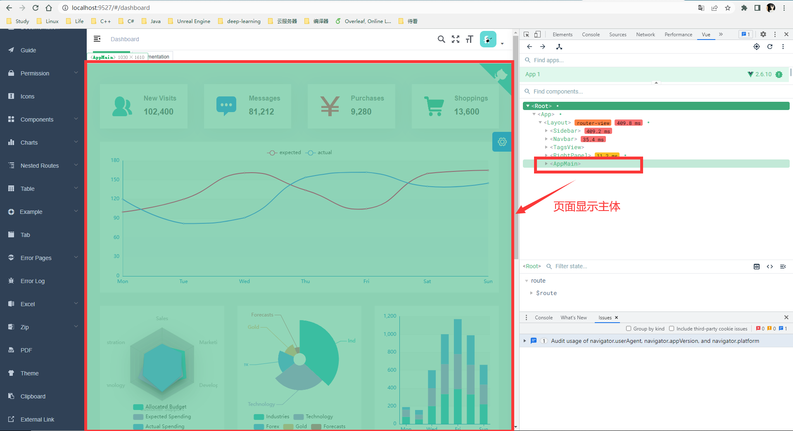
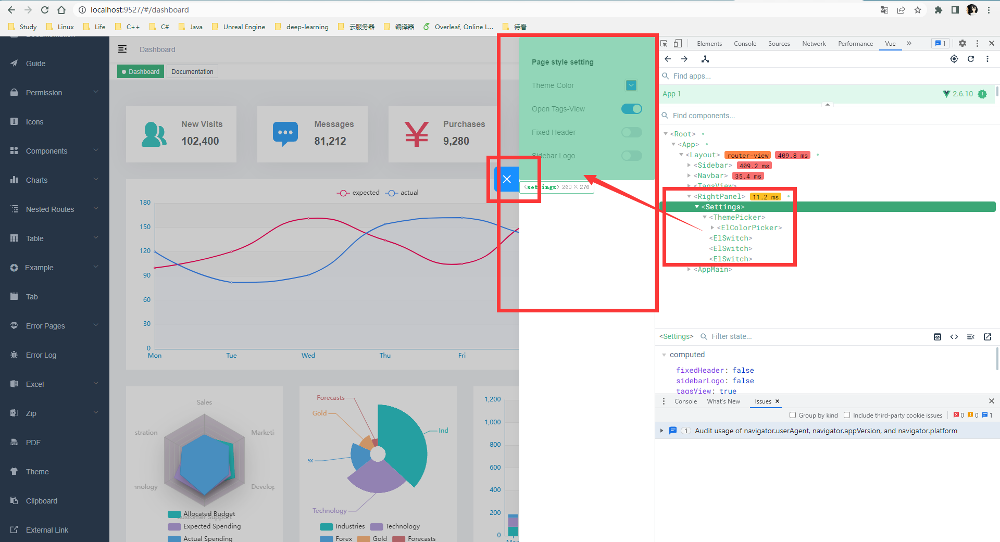

# 项目的总架构



# 1. 项目的整体布局



整个项目的框架都是基于该`Layout`布局来进行设计的,除了个别的页面比如说：`login`、`404`、`401`等页面没有使用该`layout`，因为这几个页面仅仅展示几个简单的界面，用不上特别复杂的布局，但是项目的首页就需要我们去设计其布局了。

> 这里所谓的布局也就是页面的每一部分分别去显示什么内容，各种组件之间的切换是基于路由进行实现：
>
> ```vue
> // No layout
> {
>   path: '/401',
>   component: () => import('errorPage/401')
> }
> 
> // Has layout
> {
>   path: '/documentation',
> 
>   // 你可以选择不同的layout组件
>   component: Layout,
> 
>   // 这里开始对应的路由都会显示在app-main中 如上图所示
>   children: [{
>     path: 'index',
>     component: () => import('documentation/index'),
>     name: 'documentation'
>   }]
> }
> ```
>
> 这里我们可以看到我们这个项目几乎所有的组件都是基于父组件`Layout`的，然后通过配置嵌套路由来进行子组件的切换。

我们可以使用`Google Chrome`浏览器来查看一下，我们的项目的结构：



我们可以看到，页面中只有一个Layout父组件，其余的全部都是由子组件所组成：

## 1.1 侧边栏



## 1.2 导航栏



## 1.3Tag-View



## 1.4 主体显示内容，就是页面上主要显示的部分



## 1.5与我们无关

